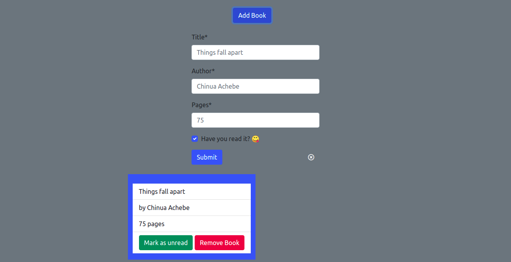

# BooksLibrary-JS-Practice

> In this project I built a simple app where you store books.



## Built With

- HTML
- Bootstrap
- Vanilla JavaScript
- Local storage

## Live Demo
[Live Demo](https://kingobaino1.github.io/Online-library/.)

## Getting Started

To get a local copy up and running follow these simple example steps.

# Instructions (Set Up)

Clone this repository in your computer
```
$  git clone git@github.com:Kingobaino1/Online-library.git
```
Access the folder where you cloned the project in your explorer and open index.html

## Author

👤 **Kingsley Ibeh**

- GitHub: [@githubhandle](https://github.com/Kingobaino1)
- Twitter: [@twitterhandle](https://twitter.com/ibehkingso)
- Linkedin: [linkedin] (https://www.linkedin.com/in/ibeh-kingsley-obinna-568596177)

## 🤝 Contributing

Contributions, issues and feature requests are welcome!
Feel free to check the issues page.

## Show your support

Give a ⭐️ if you like this project!

## Acknowledgments

- [Microverse](https://www.microverse.org/).
- [The Odin Project](https://www.theodinproject.com/).

## 📝 License

This project is [MIT licensed](/LICENSE).